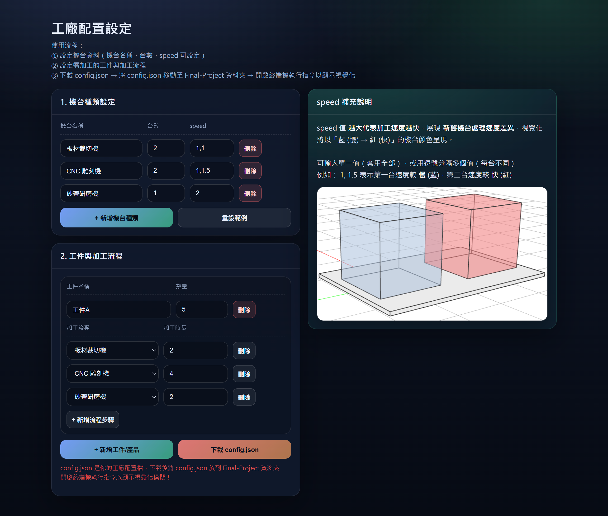
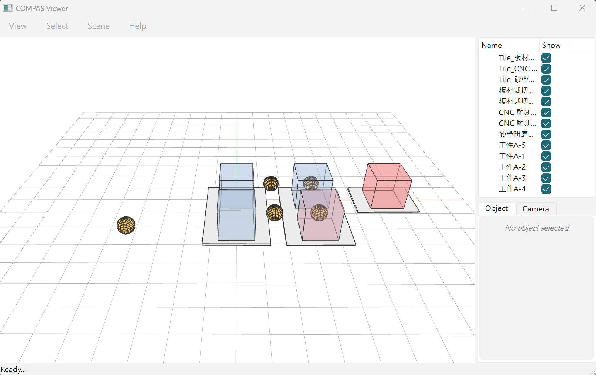

# Factory Layout Visualization Project (DCCG Final Project)

本專案旨在將工廠中的機台配置與工件加工流程視覺化，協助使用者快速理解工件在不同機台之間的加工順序、排程行為與資源使用情形。使用者可透過圖形化介面設定機台類型、台數與加工速度，以及工件加工路線並生成設定檔，進一步以 3D 動態模擬方式呈現工件流動與機台效率差異，提升流程規劃、產線溝通與配置決策的效率。

## 1. Project Overview
專案根目錄主要檔案如下：

- `config.html`：工廠設定介面（設定機台與工件流程，下載 `config.json`）
- `config.json`：工廠配置檔（由 `config.html` 下載，需放回專案根目錄）
- `visualization.py`：視覺化模擬主程式（讀取 `config.json` 並顯示動畫）
- `run_viewer.py`：跨平台啟動器（自動檢查環境、安裝套件、執行 viewer）
- `requirements.txt`：Python 套件需求清單（compas, compas_viewer）


## 2. Requirements

- Windows 10 / 11 或 macOS
- Python 3（建議 3.8 以上）
- 需要網路連線（第一次安裝套件會用到）


## 3. Usage

### Step 1：下載專案

請從 GitHub 下載並解壓縮，資料夾名稱例如：`DCCG-Final-Project-main`

### Step 2：用 `config.html` 設定工廠並下載 `config.json`

1. 打開 `config.html`


2. 設定以下內容：
   - 機台種類、台數、速度 speed
   - 工件（產品）與加工流程 route
   - 輸入限制與上限說明（Input Constraints）
     為避免設定資料過大或不合理，本系統針對「機台種類、機台台數、工件數量與流程步驟」設有上限限制。當使用者輸入或新增資料超過上限時，系統將阻止新增，並顯示提示訊息

| 類別 | 限制項目 | 上限 |
|---|---|---|
| 機台設定 | 機台種類數（Machine Types） | 10 種 |
| 機台設定 | 每種機台台數 count | 10 台 |
| 工件設定 | 工件/產品種類數（Products） | 10 個 |
| 工件設定 | 每個工件流程步驟（Route Steps） | 10 步 |
| 工件設定 | 每個工件數量 quantity | 5  個 |

3. 點選「下載 config.json」

### Step 3：把 `config.json` 放回專案根目錄

請將下載到電腦「下載資料夾」的 `config.json` 移動到：

`DCCG-Final-Project-main/`

也就是和 `visualization.py`、`run_viewer.py` 同一層。


## 4. Run the Visualization

### 4.1 Windows：在專案資料夾右鍵開啟終端機執行

1. 進入 `DCCG-Final-Project-main` 專案資料夾
2. 在資料夾內空白處 **右鍵**
3. 選擇以下其中一種（依你的 Windows 版本顯示不同）：
   - 在終端機開啟（Open in Terminal）
   - 在 PowerShell 視窗中開啟（Open PowerShell window here）
   - 在此處開啟命令提示字元（Open Command Prompt here）
4. 在終端機中輸入：

```bash
py -3 run_viewer.py
```

### 4.2 macOS：在專案資料夾開啟終端機後執行
1. 打開 Finder，進入 `DCCG-Final-Project-main` 資料夾所在位置
2. 在 `DCCG-Final-Project-main` 資料夾上 右鍵
3. 若你已啟用 Finder 服務功能，可看到：
   - 服務（Services）→ 新增在資料夾位置的終端機（New Terminal at Folder）
4. 終端機開啟後輸入：
```bash
python3 run_viewer.py
```

### 執行成功結果如下圖 ↓



## 5. Known Issues
目前系統已可穩定完成基本配置與流程視覺化，但在較複雜的輸入情境下仍有部分限制，後續將持續優化：

**⚠️ 工件重疊造成視覺誤判**

當工件數量較多、加工流程較長或同時進入相同區域時，部分工件在視覺化過程中可能因空間位置接近而產生重疊，導致使用者在觀看時可能誤以為某些工件消失或數量不足。此問題屬於顯示層面的視覺重疊，並非工件實際未生成。

**⚠️ 視覺化效能與流暢度待提升**

由於目前模擬與繪圖更新的流程尚未做最佳化，在機台與工件數量增加時，3D 視覺化畫面可能出現輕微卡頓或更新延遲。未來可透過降低更新頻率、改善物件渲染策略或優化排程計算流程來提升整體流暢度。


## 6. Frequently Asked Questions
### Q1：執行時顯示「找不到 config.json」
請確認：
1. 已用 `config.html` 下載 `config.json`
2. 已把 `config.json` 移動到專案根目錄（與 `visualization.py`、`run_viewer.py` 同一層）
3. 再重新執行：
#### Windows：
```bash
py -3 run_viewer.py
```
#### macOS：
```bash
python3 run_viewer.py
```

### Q2：第一次執行安裝套件失敗（pip權限或網路問題）
請先確認網路正常，並嘗試使用以下指令：
#### Windows：
```bash
py -3 -m pip install --user -r requirements.txt
```
#### macOS：
```bash
python3 -m pip install --user -r requirements.txt
```
安裝完成後再執行：
```bash
py -3 run_viewer.py
```
或
```bash
python3 run_viewer.py
```
